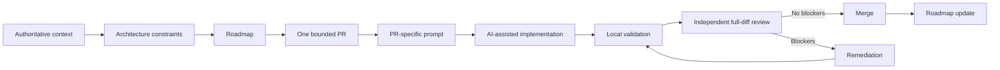

# AI-Assisted Engineering Template

**Architecture-governed workflow for building software with AI coding agents.**

A reusable repository template for engineers and architects who want AI-assisted development to remain bounded, traceable, independently reviewable, and driven by explicit architecture rather than disposable chat prompts.

> AI may accelerate engineering, but project truth, architecture boundaries, validation evidence, and merge decisions remain governed engineering artifacts.

## Why this exists

AI coding agents are effective at implementation, but large projects fail when the agent has to infer project truth from an incomplete conversation. This template moves the durable context into the repository and establishes a repeatable engineering control loop around AI-assisted changes.

It is designed to answer five practical questions:

- What must an AI agent read before changing code?
- How do we stop a large roadmap from turning into an unreviewable implementation batch?
- How do we distinguish architecture decisions from implementation decisions?
- How do we independently verify what an agent actually changed?
- How do we retain traceability when prompts, implementation and review are AI-assisted?

## Core workflow



See [`doc/workflow.md`](doc/workflow.md) for the operating model and [`doc/diagrams/workflow.md`](doc/diagrams/workflow.md) for the standalone workflow view.

## Principles

- **Authoritative context before implementation.** Agents read project governance, architecture, roadmap, and applicable local instructions before changing code.
- **Architecture ambiguity is a blocker.** An agent must not silently invent a material architecture decision when authoritative context does not determine it.
- **One PR, one bounded objective.** Changes remain reviewable, traceable, and reversible.
- **Prompts are engineering artifacts.** PR-specific implementation and remediation prompts can be versioned with the project.
- **Implementation and review are separate concerns.** Review the actual diff and repository state independently of implementation claims.
- **Tests are evidence.** Record exact validation commands and results and distinguish baseline failures from regressions.
- **Roadmap state follows repository reality.** Planning state changes only when implementation and review outcomes justify it.
- **Human governance remains explicit.** AI can propose, implement, test, and review; material architecture and merge authority follow project policy.

## Quick start

1. Use this repository as a template or clone it.
2. Replace placeholders in `PROJECT_CONTEXT.md`.
3. Tailor root `AGENTS.md` to the project.
4. Define architecture principles and initial decisions under `doc/architecture/`.
5. Create an executable roadmap from `doc/roadmaps/roadmap-template.md`.
6. Use `doc/prompts/next-pr.md` to select exactly one next bounded change.
7. Save the resulting PR-specific prompt under `doc/codex-prompts/<roadmap-or-task>/`.
8. Implement the PR with an AI coding agent.
9. Run the repository's local validation commands.
10. Use `doc/prompts/pr-review.md` for an independent full-diff review.
11. If blockers exist, use `doc/prompts/remediation.md` and re-review the resulting HEAD.
12. Merge only when the applicable acceptance criteria are satisfied, then update roadmap state.

## Minimum adoption checklist

Before the first AI-assisted implementation PR, make sure the project has:

- [ ] project purpose, scope, runtime, and quality gates in `PROJECT_CONTEXT.md`;
- [ ] root AI/contributor governance in `AGENTS.md`;
- [ ] system/module boundaries in `doc/architecture/context.md`;
- [ ] project-specific architecture invariants;
- [ ] at least one active roadmap with bounded PR items;
- [ ] exact local or CI validation commands;
- [ ] a defined policy for architecture blockers;
- [ ] a human merge authority.

Do not fill every template section merely because it exists. Delete irrelevant placeholders and keep authoritative context compact enough to remain usable.

## Worked example

The fictional [`Document Status Notifier`](examples/document-status-notifier/) demonstrates the complete artifact chain without requiring a full application:

```text
PROJECT_CONTEXT
    ↓
Roadmap PR-1.1
    ↓
PR-specific implementation prompt
    ↓
Illustrative independent review
```

This is the fastest way to understand the intended level of detail before adapting the template to a real project.

## Repository structure

```text
.
├── AGENTS.md                         # repository-wide AI/contributor rules
├── PROJECT_CONTEXT.md                # compact authoritative project context
├── CONTRIBUTING.md
├── SECURITY.md
├── .github/
│   ├── pull_request_template.md
│   └── ISSUE_TEMPLATE/
├── doc/
│   ├── workflow.md                   # detailed operating model
│   ├── diagrams/workflow.md          # portable Mermaid workflow
│   ├── architecture/
│   │   ├── context.md
│   │   ├── principles.md
│   │   └── decisions/ADR-0000-template.md
│   ├── codex-prompts/                # versioned project execution prompts
│   ├── prompts/                      # reusable workflow prompts
│   │   ├── next-pr.md
│   │   ├── implementation.md
│   │   ├── pr-review.md
│   │   └── remediation.md
│   ├── roadmaps/roadmap-template.md
│   └── standards/
│       ├── code-quality.md
│       ├── documentation.md
│       ├── prompt-design.md
│       └── testing.md
├── examples/document-status-notifier/
└── templates/bounded-context-AGENTS.template.md
```

## Artifact model

| Artifact | Purpose |
| --- | --- |
| `PROJECT_CONTEXT.md` | Project identity, scope, stack, invariants, quality gates, and current roadmap pointer |
| `AGENTS.md` | Repository-wide rules that AI agents and contributors must obey |
| Local `AGENTS.md` | Additional rules for one bounded context/subtree |
| `doc/architecture/*` | System boundaries, principles, and durable architecture decisions |
| `doc/roadmaps/*` | Dependency-aware sequencing into bounded PRs |
| `doc/prompts/*` | Reusable prompts for the engineering workflow |
| `doc/codex-prompts/*` | Project-specific, versioned execution prompts |
| `doc/standards/prompt-design.md` | Quality gate for PR-specific prompts |
| `.github/pull_request_template.md` | PR traceability and factual validation evidence |
| `.github/ISSUE_TEMPLATE/*` | Structured intake for bounded changes and architecture decisions |

## Architecture blockers

Implementation stops when a material decision cannot be derived from authoritative context, for example when ownership boundaries are unclear, authoritative documents conflict, compatibility policy is missing for a public contract change, persistence/security/consistency semantics require a new decision, or the requested change violates an explicit invariant.

The agent should report the decision required, alternatives considered, affected scope, and why implementation cannot safely proceed. It should not disguise an architecture decision as an implementation detail.

## Independent review model

Review the **actual PR HEAD**, not the implementation summary. The review covers scope, roadmap traceability, architecture boundaries, runtime correctness, tests, documentation, duplication/reuse, maintainability, and repository-specific quality gates.

Findings are classified as **BLOCKER** or **WARNING**. `APPROVE` is valid only when no mandatory blockers remain.

This makes the review useful even when the same AI family participates in implementation and review: the reviewer receives a different task, reconstructs authoritative context independently, and evaluates repository evidence rather than trusting the implementation narrative.

## CI policy

Hosted CI is optional. Projects may rely on local validation when hosted execution is unavailable or intentionally disabled. Absence of hosted CI is not itself a merge blocker in that case; the PR records exact local commands and factual results. Projects that require CI should declare their required checks in `AGENTS.md` and `doc/standards/testing.md`.

## Security and confidentiality

Treat AI prompts, logs, test fixtures, and generated documentation as potential disclosure surfaces. Do not put real secrets, production data, personal data, private keys, or confidential internal architecture into the repository or prompts. See [`SECURITY.md`](SECURITY.md).

## What this template is not

This is not a universal prompt collection, autonomous SDLC, or replacement for engineering judgment. It provides a reusable control structure. Each project still defines its architecture, invariants, security requirements, test strategy, acceptance criteria, and merge authority.

## License

MIT. See [`LICENSE`](LICENSE).