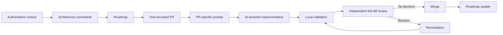

# AI-Assisted Engineering Template

**Architecture-governed workflow for building software with AI coding agents.**

A reusable repository template for engineers and architects who want AI-assisted development to remain bounded, traceable, independently reviewable, and driven by explicit architecture rather than disposable chat prompts.

> AI may accelerate engineering, but project truth, architecture boundaries, validation evidence, and merge decisions remain governed engineering artifacts.

## Start here

New project? Do not study the repository file by file.

1. Use this repository as a template or clone it.
2. Open **[`BOOTSTRAP.md`](BOOTSTRAP.md)**.
3. Fill the minimum project contract in `PROJECT_CONTEXT.md`.
4. Pass the two bootstrap checklists.
5. Run `doc/prompts/bootstrap-first-pr.md` to obtain exactly one implementation-ready bounded PR prompt.
6. Implement and independently review that PR.

The bootstrap path is designed to move a new user from an untouched template to the first correctly governed bounded PR without requiring prior knowledge of the complete documentation set.

## Why this exists

AI coding agents are effective at implementation, but large projects fail when the agent has to infer project truth from an incomplete conversation. This template moves the durable context into the repository and establishes a repeatable engineering control loop around AI-assisted changes.

It is designed to answer five practical questions:

- What must an AI agent read before changing code?
- How do we stop a large roadmap from turning into an unreviewable implementation batch?
- How do we distinguish architecture decisions from implementation decisions?
- How do we independently verify what an agent actually changed?
- How do we retain traceability when prompts, implementation and review are AI-assisted?

## Core workflow

See [`doc/workflow.md`](doc/workflow.md) for the operating model and [`doc/diagrams/workflow.md`](doc/diagrams/workflow.md) for the standalone workflow view.

## Principles

- **Authoritative context before implementation.** Agents read project governance, architecture, roadmap, and applicable local instructions before changing code.
- **Architecture ambiguity is a blocker.** An agent must not silently invent a material architecture decision when authoritative context does not determine it.
- **One PR, one bounded objective.** Changes remain reviewable, traceable, and reversible.
- **Prompts are engineering artifacts.** PR-specific implementation and remediation prompts can be versioned with the project.
- **Implementation and review are separate concerns.** Review the actual diff and repository state independently of implementation claims.
- **Tests are evidence.** Record exact validation commands and results and distinguish baseline failures from regressions.
- **Roadmap state follows repository reality.** Planning state changes only when implementation and review outcomes justify it.
- **Human governance remains explicit.** AI can propose, implement, test, and review; material architecture and merge authority follow project policy.

## After bootstrap

Once the first bounded PR has passed review, use the normal operating loop:

1. use `doc/prompts/next-pr.md` to select exactly one next bounded change;
2. save its PR-specific prompt under `doc/codex-prompts/<roadmap-or-task>/`;
3. implement it with the coding agent;
4. run the project's required local validation;
5. use `doc/prompts/pr-review.md` for independent full-diff review;
6. use `doc/prompts/remediation.md` when blockers require correction;
7. merge only when acceptance criteria are satisfied and update roadmap state.

## Repository map

- `BOOTSTRAP.md` — guided adoption path for a new project.
- `PROJECT_CONTEXT.md` — compact authoritative project contract.
- `AGENTS.md` — repository-wide rules for AI coding agents.
- `doc/bootstrap/` — context and adoption readiness gates.
- `doc/architecture/` — architecture context, principles, and ADRs.
- `doc/roadmaps/` — bounded implementation planning.
- `doc/prompts/` — reusable reasoning/review prompt templates.
- `doc/codex-prompts/` — active PR-specific implementation artifacts.
- `doc/standards/` — engineering, testing, documentation, and prompt quality rules.
- `templates/` — reusable local governance templates.
- `examples/` — worked examples showing the workflow in practice.

## Minimum adoption contract

Before the first AI-assisted implementation PR, the project must have enough information for an independent agent to determine, without guessing:

- project purpose and explicit scope/non-goals;
- architecture and ownership boundaries;
- authoritative sources and their precedence;
- critical invariants;
- required validation and CI/local-evidence policy;
- confidentiality/publication constraints;
- one active roadmap and its first admissible bounded item;
- human architecture and merge authority.

The detailed gates live in `doc/bootstrap/`. Do not fill documentation merely because a template section exists; keep project truth compact, current, and authoritative.

## What this template is not

This repository is not a framework, coding-agent wrapper, or autonomous development system. It does not replace architecture ownership, engineering judgment, code review, or project-specific testing. It provides a governance and execution structure for using AI agents inside a disciplined software delivery process.

## License

See [`LICENSE`](LICENSE).