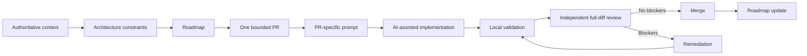

# AI-assisted engineering workflow

## Control points

1. **Authoritative context** — project facts, architecture and repository governance are loaded before implementation.
2. **Bounded PR** — exactly one reviewable objective is selected from the roadmap.
3. **PR-specific prompt** — scope, constraints, acceptance criteria and validation are explicit.
4. **Local validation** — factual commands and results provide implementation evidence.
5. **Independent review** — review is based on the actual PR HEAD rather than the implementation summary.
6. **Remediation loop** — blockers are fixed and the complete affected invariant is re-reviewed.
7. **Merge and roadmap update** — repository reality drives planning state.

The workflow deliberately separates **planning**, **implementation**, **verification**, and **merge authority**. AI agents may participate in each technical stage, but they do not replace authoritative project context or engineering governance.